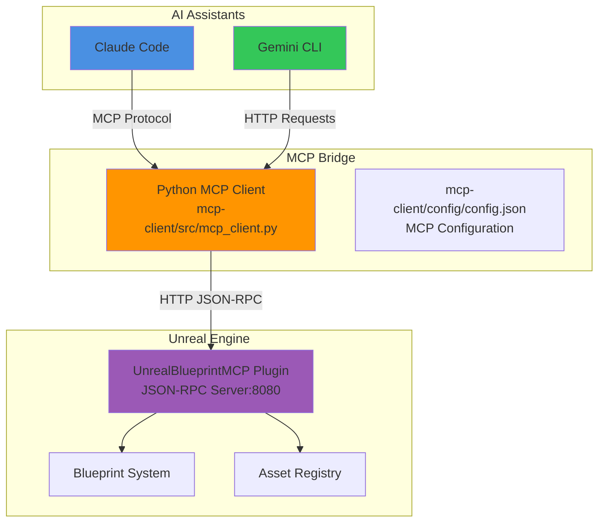
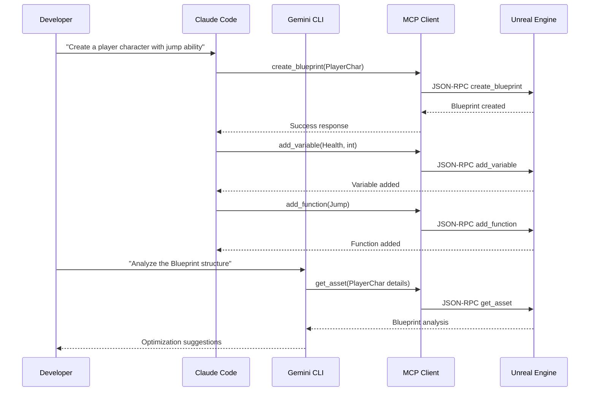

# Unreal Blueprint MCP - Claude Code & Gemini CLI Integration Guide

[](https://claude.ai/code)
[](https://ai.google.dev/gemini-api)
[](https://www.unrealengine.com/)

A comprehensive guide to integrate Unreal Blueprint MCP with Claude Code and Gemini CLI for AI-powered game development workflows.

## 📋 Table of Contents

1. [Overview](#-overview)
2. [Quick Start](#-quick-start)
3. [Claude Code Integration](#-claude-code-integration)
4. [Gemini CLI Integration](#-gemini-cli-integration)
5. [Complete Workflow](#-complete-workflow)
6. [Usage Examples](#-usage-examples)
7. [Troubleshooting](#-troubleshooting)
8. [Advanced Configuration](#-advanced-configuration)

## 🎯 Overview

This integration enables seamless communication between AI assistants (Claude Code & Gemini CLI) and Unreal Engine through the Blueprint MCP protocol.

### Architecture Overview



### What You'll Achieve

- **AI-Powered Blueprint Creation**: Create Blueprints through natural language
- **Automated Asset Management**: List, inspect, and modify Unreal assets
- **Intelligent Development**: Get context-aware suggestions and solutions
- **Seamless Workflow**: Switch between Claude Code and Gemini CLI effortlessly

## 🚀 Quick Start

### Prerequisites

- **Unreal Engine**: 5.6 or later with a project
- **Python**: 3.7+ with pip installed
- **Claude Code**: Latest version with MCP support
- **Gemini CLI**: Latest version (optional)

### 5-Minute Setup

```bash
# 1. Clone the repository
git clone https://github.com/yourusername/unreal-blueprint-mcp.git
cd unreal-blueprint-mcp

# 2. Install Python dependencies
pip install -r requirements.txt

# 3. Install Unreal plugin
cp -r . "[YourProject]/Plugins/UnrealBlueprintMCP"

# 4. Build and enable plugin in Unreal Engine
# (See detailed steps below)

# 5. Test the connection
python mcp-client/tests/test_mcp_api.py
```

## 🔧 Claude Code Integration

### Step 1: Install MCP Dependencies

```bash
# Install required MCP packages
pip install mcp httpx asyncio
```

### Step 2: Configure Claude Code MCP Settings

**Option A: Automatic Configuration**

Copy the provided `config.json` to your Claude Code MCP configuration directory:

```bash
# Linux/macOS
cp mcp-client/config/config.json ~/.config/claude-code/mcp_settings.json

# Windows
copy mcp-client\config\config.json "%APPDATA%\claude-code\mcp_settings.json"
```

**Option B: Manual Configuration**

Add this configuration to your Claude Code MCP settings:

```json
{
  "mcpServers": {
    "unreal-blueprint-mcp": {
      "command": "python",
      "args": [
        "/home/bestdev/mcp/unreal-blueprint-mcp/mcp-client/src/mcp_client.py"
      ],
      "env": {
        "UNREAL_SERVER_URL": "http://localhost:8080"
      }
    }
  }
}
```

**Important Configuration Notes:**
- Replace `/home/bestdev/mcp/unreal-blueprint-mcp/mcp-client/src/mcp_client.py` with your actual file path
- Ensure Python is in your system PATH
- The Unreal Engine plugin must be running on port 8080

### Step 3: Verify Claude Code Integration

1. **Start Unreal Engine** with your project and enable the UnrealBlueprintMCP plugin
2. **Restart Claude Code** to load the new MCP configuration
3. **Test the connection** by asking Claude Code:

```
Can you list the available Unreal Blueprint tools?
```

Expected response should show tools like `create_blueprint`, `add_variable`, `add_function`, etc.

### Step 4: Available MCP Tools in Claude Code

Once configured, Claude Code can access these tools:

| Tool | Description | Usage |
|------|-------------|--------|
| `create_blueprint` | Create new Blueprint classes | "Create a new player character Blueprint" |
| `add_variable` | Add variables to Blueprints | "Add a health variable to the player Blueprint" |
| `add_function` | Add functions to Blueprints | "Add a jump function to the character" |
| `edit_graph` | Edit Blueprint graphs | "Add BeginPlay and PrintString nodes" |
| `list_assets` | List project assets | "Show me all Blueprints in the project" |
| `get_asset` | Get asset details | "Show details of the player Blueprint" |

## 🤖 Gemini CLI Integration

### Step 1: Install Gemini CLI

```bash
# Install Gemini CLI (if not already installed)
curl -fsSL https://ai.google.dev/gemini-api/docs/quickstart/cli/install | bash

# Or via pip
pip install google-generativeai
```

### Step 2: Configure Gemini CLI for MCP

Create a Gemini CLI configuration file:

```bash
# Create config directory
mkdir -p ~/.config/gemini-cli

# Create configuration
cat > ~/.config/gemini-cli/unreal-mcp.json << 'EOF'
{
  "name": "unreal-blueprint-mcp",
  "description": "Unreal Engine Blueprint integration",
  "base_url": "http://localhost:8080",
  "endpoints": {
    "ping": "/",
    "blueprints": "/api/blueprints",
    "assets": "/api/assets",
    "tools": "/api/tools"
  }
}
EOF
```

### Step 3: Create Gemini Helper Scripts

Create utility scripts for common operations:

**mcp-client/tools/unreal-helper.py**
```python
#!/usr/bin/env python3
"""
Gemini CLI helper for Unreal Engine operations
"""

import requests
import json
import sys

def call_unreal_api(method, params=None):
    """Call Unreal Engine JSON-RPC API"""
    payload = {
        "jsonrpc": "2.0",
        "method": method,
        "params": params or {},
        "id": 1
    }
    
    try:
        response = requests.post(
            "http://localhost:8080",
            json=payload,
            headers={"Content-Type": "application/json"}
        )
        return response.json()
    except Exception as e:
        return {"error": str(e)}

def main():
    if len(sys.argv) < 2:
        print("Usage: python unreal-helper.py <method> [params_json]")
        sys.exit(1)
    
    method = sys.argv[1]
    params = json.loads(sys.argv[2]) if len(sys.argv) > 2 else None
    
    result = call_unreal_api(method, params)
    print(json.dumps(result, indent=2))

if __name__ == "__main__":
    main()
```

Make it executable:
```bash
chmod +x mcp-client/tools/unreal-helper.py
```

### Step 4: Using Gemini CLI with Unreal Engine

Now you can use Gemini CLI with Unreal Engine context:

```bash
# Example: Ask Gemini to create a Blueprint
echo "Create a new player character Blueprint named 'PlayerChar' in '/Game/Characters'. Use the helper script to call tools.create_blueprint with appropriate parameters." | gemini -f mcp-client/tools/unreal-helper.py

# Example: Get project analysis
echo "List all Blueprints in the project and analyze their structure for potential improvements" | gemini -f mcp-client/tools/unreal-helper.py
```

## 🔄 Complete Workflow

### End-to-End Development Workflow



### Collaborative Development Pattern

1. **Use Claude Code for Implementation**
   - Create Blueprints and assets
   - Add variables and functions
   - Implement game logic

2. **Use Gemini CLI for Analysis**
   - Analyze project structure
   - Get optimization suggestions
   - Research best practices

3. **Iterate and Improve**
   - Apply suggestions via Claude Code
   - Validate changes with Gemini CLI
   - Continuous improvement cycle

## 💡 Usage Examples

### Example 1: Creating a Complete Player Character

**With Claude Code:**
```
Create a complete player character Blueprint with the following:
- Name: "BP_PlayerCharacter" 
- Location: "/Game/Characters/"
- Parent class: Character
- Variables: Health (float, default 100), Speed (float, default 600)
- Function: TakeDamage with parameter DamageAmount (float)
```

**With Gemini CLI:**
```bash
echo "Analyze the BP_PlayerCharacter Blueprint and suggest improvements for a third-person action game" | gemini -f mcp-client/tools/unreal-helper.py
```

### Example 2: Building a Collectible System

**Step 1 - Claude Code creates the structure:**
```
Create a collectible system with:
1. Blueprint "BP_Collectible" (Actor parent)
2. Variables: Points (int), CollectSound (SoundCue), Mesh (StaticMesh)
3. Function: OnCollected with Player parameter
```

**Step 2 - Gemini CLI provides enhancement ideas:**
```bash
echo "Review the BP_Collectible Blueprint and suggest additional features for an engaging collection system" | gemini -f mcp-client/tools/unreal-helper.py
```

**Step 3 - Claude Code implements suggestions:**
```
Based on the suggestions, add these enhancements to BP_Collectible:
- Variable: RarityLevel (enum) 
- Function: PlayCollectEffect
- Graph nodes: Spawn particle effect on collection
```

### Example 3: Performance Optimization Workflow

**Gemini CLI analysis:**
```bash
echo "Analyze all Blueprints in the project for performance issues and provide optimization recommendations" | gemini -f mcp-client/tools/unreal-helper.py
```

**Claude Code implementation:**
```
Apply the following optimizations to the identified Blueprints:
1. Replace Event Tick with Timer-based updates
2. Add object pooling for frequently spawned objects
3. Optimize collision detection settings
```

## 🔧 Troubleshooting

### Common Issues and Solutions

#### Issue 1: Claude Code Can't Connect to MCP Server

**Symptoms:**
- "MCP server not responding" error
- Tools not available in Claude Code

**Solutions:**
```bash
# Check if Unreal Engine is running
curl -s http://localhost:8080 | grep -q "MCP" && echo "✅ Server running" || echo "❌ Server not responding"

# Verify Python dependencies
python -c "import mcp, httpx; print('✅ MCP dependencies OK')"

# Check MCP client directly
python mcp-client/src/mcp_client.py
```

#### Issue 2: Gemini CLI Helper Script Fails

**Symptoms:**
- "Connection refused" errors
- JSON parsing errors

**Solutions:**
```bash
# Test direct API access
curl -X POST http://localhost:8080 \
  -H "Content-Type: application/json" \
  -d '{"jsonrpc":"2.0","method":"ping","id":1}'

# Check Python requests
python -c "import requests; print('✅ Requests available')"

# Validate JSON parameters
echo '{"test": "value"}' | python -m json.tool
```

#### Issue 3: Unreal Engine Plugin Not Responding

**Symptoms:**
- Port 8080 not accessible
- Plugin not starting

**Solutions:**
1. **Check Plugin Status:**
   - Open Unreal Editor → Edit → Plugins
   - Search "UnrealBlueprintMCP"
   - Ensure it's enabled and compiled

2. **Verify Output Log:**
   Look for these messages:
   ```
   ✅ MCPJsonRpcServer: Server started on port 8080
   ❌ MCPJsonRpcServer: Failed to bind to port 8080
   ```

3. **Port Conflicts:**
   ```bash
   # Check what's using port 8080
   netstat -tulpn | grep :8080
   
   # Kill conflicting processes if needed
   sudo fuser -k 8080/tcp
   ```

### Diagnostic Commands

```bash
# Complete system check
./mcp-client/tools/diagnostic-check.sh
```

**mcp-client/tools/diagnostic-check.sh:**
```bash
#!/bin/bash
echo "🔍 Unreal Blueprint MCP Diagnostic Check"
echo "======================================"

# Check Unreal Engine server
echo "1. Testing Unreal Engine connection..."
if curl -s http://localhost:8080 > /dev/null; then
    echo "✅ Unreal Engine server responding"
else
    echo "❌ Unreal Engine server not responding"
fi

# Check Python environment
echo "2. Testing Python environment..."
python -c "import mcp, httpx, requests" 2>/dev/null && echo "✅ Python dependencies OK" || echo "❌ Missing Python dependencies"

# Check MCP client
echo "3. Testing MCP client..."
timeout 5 python mcp-client/src/mcp_client.py > /dev/null 2>&1 && echo "✅ MCP client working" || echo "❌ MCP client issues"

# Check file permissions
echo "4. Checking file permissions..."
[ -r "mcp-client/src/mcp_client.py" ] && echo "✅ MCP client readable" || echo "❌ MCP client not readable"
[ -r "mcp-client/config/config.json" ] && echo "✅ Config file readable" || echo "❌ Config file not readable"

echo "======================================"
echo "Diagnostic complete!"
```

## ⚙️ Advanced Configuration

### Custom Port Configuration

If port 8080 is unavailable, configure a custom port:

**1. Update Unreal Engine Plugin:**
```cpp
// In MCPJsonRpcServer.cpp
static const int32 DEFAULT_PORT = 8081; // Change from 8080
```

**2. Update MCP Client:**
```python
# In mcp-client/src/mcp_client.py
DEFAULT_UNREAL_SERVER_URL = "http://localhost:8081"
```

**3. Update Configuration:**
```json
{
  "mcpServers": {
    "unreal-blueprint-mcp": {
      "env": {
        "UNREAL_SERVER_URL": "http://localhost:8081"
      }
    }
  }
}
```

### Multiple Project Support

Configure different MCP instances for multiple Unreal projects:

```json
{
  "mcpServers": {
    "unreal-project-a": {
      "command": "python",
      "args": ["/path/to/mcp-client/src/mcp_client.py"],
      "env": {
        "UNREAL_SERVER_URL": "http://localhost:8080"
      }
    },
    "unreal-project-b": {
      "command": "python", 
      "args": ["/path/to/mcp-client/src/mcp_client.py"],
      "env": {
        "UNREAL_SERVER_URL": "http://localhost:8081"
      }
    }
  }
}
```

### Environment Variables

Set up environment variables for flexible configuration:

```bash
# Add to ~/.bashrc or ~/.zshrc
export UNREAL_MCP_PORT=8080
export UNREAL_MCP_HOST=localhost
export UNREAL_PROJECT_PATH="/path/to/project"
```

### Performance Tuning

Optimize MCP performance for large projects:

```python
# In mcp-client/src/mcp_client.py
class UnrealBlueprintMCPServer:
    def __init__(self):
        self.http_client = httpx.AsyncClient(
            timeout=60.0,  # Increase timeout for large operations
            limits=httpx.Limits(max_connections=10)  # Connection pooling
        )
```

---

## 🎉 You're Ready!

You now have a complete integration of Unreal Blueprint MCP with both Claude Code and Gemini CLI. This setup enables:

- **AI-powered Blueprint development** through natural language
- **Intelligent asset management** with context-aware suggestions  
- **Collaborative workflows** between different AI assistants
- **Automated game development** processes

### Next Steps

1. **Explore the examples** in the Usage Examples section
2. **Create your first AI-assisted Blueprint** using Claude Code
3. **Analyze your project** with Gemini CLI insights
4. **Share your experiences** and contribute improvements

### Resources

- **Plugin Documentation**: See [README.md](README.md) for detailed API reference
- **Technical Details**: Check [TECHNICAL_GUIDE.md](TECHNICAL_GUIDE.md) for implementation details
- **User Guide**: Review [USER_GUIDE.md](USER_GUIDE.md) for step-by-step tutorials

**Happy developing with AI-powered Unreal Engine workflows!** 🚀