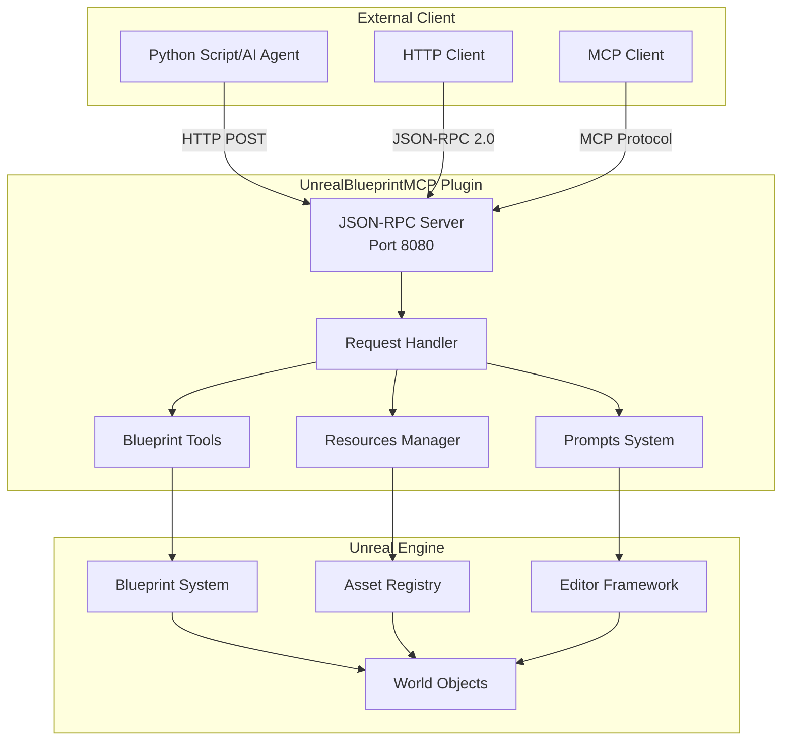
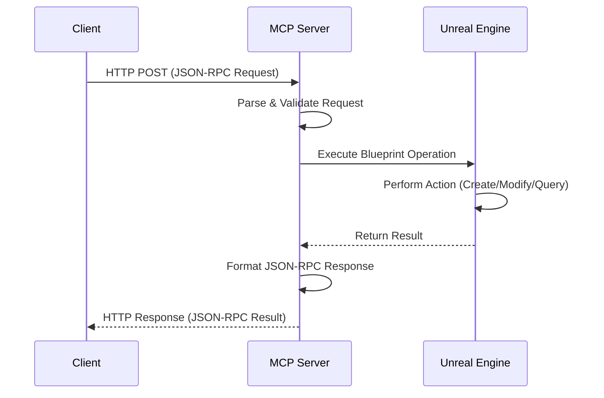
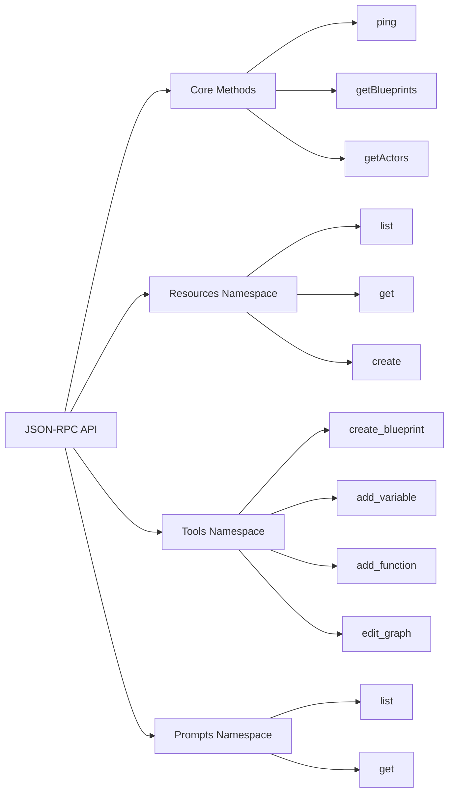
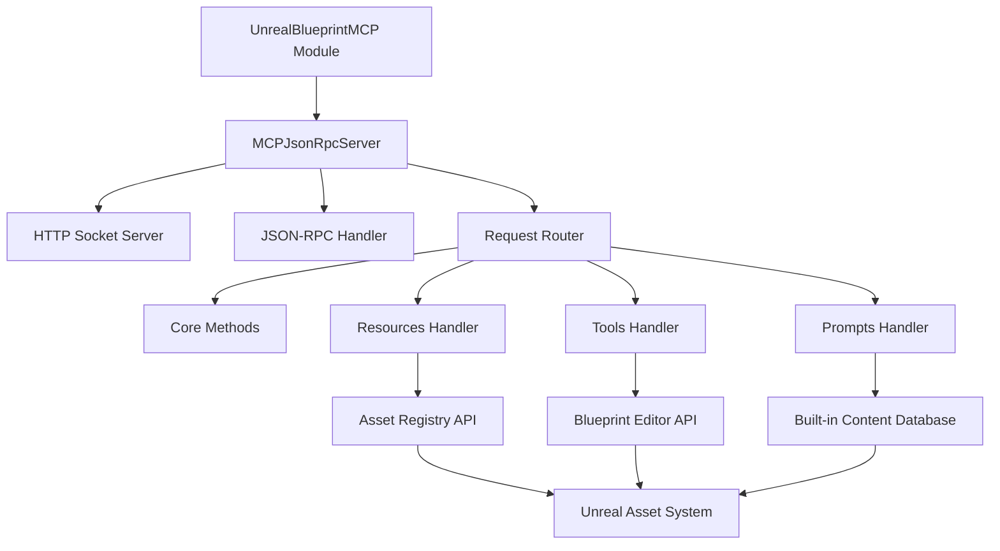

# UnrealBlueprintMCP

[](https://www.unrealengine.com/)
[](https://www.jsonrpc.org/specification)
[](#license)

UnrealBlueprintMCP is a powerful Unreal Engine 5.6+ editor plugin that provides comprehensive JSON-RPC server functionality for Blueprint integration with MCP (Model Context Protocol). This plugin enables external applications and AI systems to interact with Unreal Engine projects programmatically, offering a seamless bridge between game development tools and automation systems.

## 🚀 Key Features

### Core Functionality
- **🎯 Editor-only plugin**: Designed specifically for use within the Unreal Editor
- **🌐 JSON-RPC 2.0 Server**: Lightweight HTTP server with full JSON-RPC 2.0 compliance
- **⚡ Automatic lifecycle management**: Server starts on plugin load, stops on plugin unload
- **🔒 Thread-safe operations**: Async request handling for stable performance

### Blueprint Integration
- **📋 Resources management**: List, get details, and create Unreal assets via API
- **🔨 Blueprint tools**: Create Blueprints, add variables, functions, and edit graphs programmatically
- **📊 Asset inspection**: Query Blueprint properties, variables, and function signatures
- **🎮 Actor management**: Interact with world actors and their properties

### Development Support
- **📚 Game development prompts**: Built-in guides for 6 common game development tasks
- **🧪 Comprehensive testing**: Full API test suite with Python script
- **📖 Extensive documentation**: Complete API reference with examples
- **🛠️ Developer-friendly**: Simple setup and integration process

### Architecture
- **🏗️ Minimal and clean**: Following the "Simple is best" principle
- **🔌 Modular design**: Easily extensible for custom functionality
- **📦 Zero external dependencies**: Uses only standard Unreal Engine modules

## 📦 Installation & Setup

### System Requirements
- **Unreal Engine**: 5.6 or later
- **IDE**: Visual Studio 2022 (Windows) or Xcode (macOS)
- **Git**: For version control (optional)
- **Python 3.7+**: For running test scripts (optional)

### Quick Start Guide

#### 1. **Install the Plugin**
```bash
# Clone or download this repository
git clone https://github.com/BestDev/unreal_blueprint_mcp.git

# Copy to your project's Plugins directory
cp -r unreal-blueprint-mcp [YourProject]/Plugins/UnrealBlueprintMCP
```

#### 2. **Generate Project Files**
Choose one of the following methods:

**Method A: Using Unreal Editor (Recommended)**
1. Right-click on your `.uproject` file
2. Select "Generate Visual Studio project files"

**Method B: Command Line**
```bash
# Windows
"[UE5_DIR]/Engine/Binaries/DotNET/UnrealBuildTool.exe" -projectfiles -project="[YourProject].uproject" -game -rocket -progress

# macOS/Linux
"[UE5_DIR]/Engine/Binaries/DotNET/UnrealBuildTool" -projectfiles -project="[YourProject].uproject" -game -rocket -progress
```

#### 3. **Build the Project**
**Method A: Using IDE**
1. Open the generated `.sln` file in Visual Studio
2. Set configuration to "Development Editor"
3. Build the solution (Ctrl+Shift+B)

**Method B: Command Line**
```bash
# Windows
"[UE5_DIR]/Engine/Build/BatchFiles/Build.bat" [YourProject]Editor Win64 Development "[YourProject].uproject"

# macOS
"[UE5_DIR]/Engine/Build/BatchFiles/Mac/Build.sh" [YourProject]Editor Mac Development "[YourProject].uproject"
```

#### 4. **Enable the Plugin**
1. Launch Unreal Editor with your project
2. Navigate to **Edit → Plugins**
3. Search for "UnrealBlueprintMCP"
4. Check the **Enabled** checkbox
5. **Restart** the editor when prompted

#### 5. **Verify Installation**
After restart, check the Output Log for:
```
MCPJsonRpcServer: Server started on port 8080
```

### Testing the Installation

Run the included test script to verify all functionality:
```bash
# Install required Python packages
pip install -r mcp-client/requirements.txt

# Run the test suite
python mcp-client/tests/test_mcp_api.py
```

Expected output should show successful connectivity and API responses.

## 🔌 Usage & API Reference

### Server Configuration
- **Protocol**: HTTP with JSON-RPC 2.0 compliance
- **Default Port**: 8080 (configurable)
- **Endpoint**: `http://localhost:8080`
- **Auto-start**: Automatically starts when plugin loads
- **Auto-stop**: Automatically stops when plugin unloads
- **Threading**: Async request handling for non-blocking operations

### Architecture Overview



### API Request Flow



### 📚 Complete API Reference

The API is organized into four main namespaces:



#### 🔧 Core Methods

##### **ping** - Server Health Check
Tests server connectivity and returns basic information.

**Request:**
```json
{
  "jsonrpc": "2.0",
  "method": "ping",
  "id": 1
}
```

**Response:**
```json
{
  "jsonrpc": "2.0",
  "result": {
    "status": "pong",
    "server": "UnrealBlueprintMCP",
    "version": "1.3"
  },
  "id": 1
}
```

##### **getBlueprints** - List Blueprint Assets
Returns a list of Blueprint assets in the project.

**Request:**
```json
{
  "jsonrpc": "2.0",
  "method": "getBlueprints",
  "id": 2
}
```

**Response:**
```json
{
  "jsonrpc": "2.0",
  "result": {
    "blueprints": [
      {
        "name": "BP_PlayerCharacter",
        "path": "/Game/Blueprints/BP_PlayerCharacter",
        "type": "Blueprint"
      }
    ],
    "count": 1
  },
  "id": 2
}
```

##### **getActors** - List World Actors
Returns a list of actors in the current world.

**Request:**
```json
{
  "jsonrpc": "2.0", 
  "method": "getActors",
  "id": 3
}
```

**Response:**
```json
{
  "jsonrpc": "2.0",
  "result": {
    "actors": [
      {
        "name": "PlayerStart",
        "class": "PlayerStart",
        "location": "0,0,0"
      }
    ],
    "count": 1
  },
  "id": 3
}
```

#### 📁 Resources Namespace

##### **resources.list** - List Project Assets
Lists assets in a specified directory.

| Parameter | Type | Required | Description |
|-----------|------|----------|-------------|
| `path` | string | No | Directory path (default: "/Game") |

**Request:**
```json
{
  "jsonrpc": "2.0",
  "method": "resources.list",
  "params": {"path": "/Game/Blueprints"},
  "id": 4
}
```

##### **resources.get** - Get Asset Details
Retrieves detailed information about a specific asset.

| Parameter | Type | Required | Description |
|-----------|------|----------|-------------|
| `asset_path` | string | Yes | Full path to the asset |

**Request:**
```json
{
  "jsonrpc": "2.0",
  "method": "resources.get", 
  "params": {"asset_path": "/Game/Blueprints/BP_Player"},
  "id": 5
}
```

##### **resources.create** - Create New Assets
Creates new assets (currently supports Blueprints).

| Parameter | Type | Required | Description |
|-----------|------|----------|-------------|
| `asset_type` | string | Yes | Type of asset ("Blueprint") |
| `asset_name` | string | Yes | Name for the new asset |
| `path` | string | Yes | Directory to create asset in |
| `parent_class` | string | No | Parent class (default: "Actor") |

**Request:**
```json
{
  "jsonrpc": "2.0",
  "method": "resources.create",
  "params": {
    "asset_type": "Blueprint",
    "asset_name": "MyNewBlueprint", 
    "path": "/Game/Blueprints",
    "parent_class": "Character"
  },
  "id": 6
}
```

#### 🔨 Tools Namespace

The tools namespace provides advanced Blueprint manipulation capabilities.

##### **tools.create_blueprint** - Create Blueprint
Creates a new Blueprint with specified configuration.

| Parameter | Type | Required | Description |
|-----------|------|----------|-------------|
| `blueprint_name` | string | Yes | Name for the Blueprint |
| `path` | string | Yes | Directory path |
| `parent_class` | string | Yes | Parent class (Actor, Character, etc.) |

##### **tools.add_variable** - Add Blueprint Variable
Adds a variable to an existing Blueprint.

| Parameter | Type | Required | Description |
|-----------|------|----------|-------------|
| `blueprint_path` | string | Yes | Path to target Blueprint |
| `variable_name` | string | Yes | Variable name |
| `variable_type` | string | Yes | Type: bool, int, float, string, vector |
| `is_public` | boolean | No | Public visibility (default: false) |

##### **tools.add_function** - Add Blueprint Function
Adds a function to an existing Blueprint.

| Parameter | Type | Required | Description |
|-----------|------|----------|-------------|
| `blueprint_path` | string | Yes | Path to target Blueprint |
| `function_name` | string | Yes | Function name |

##### **tools.edit_graph** - Edit Blueprint Graph
Adds nodes to a Blueprint's event graph.

| Parameter | Type | Required | Description |
|-----------|------|----------|-------------|
| `blueprint_path` | string | Yes | Path to target Blueprint |
| `graph_name` | string | Yes | Graph name (EventGraph, etc.) |
| `nodes_to_add` | array | Yes | Array of node objects |

**Node Types:**
- `BeginPlay`: Event node for actor initialization
- `PrintString`: Debug output node

**Example Request:**
```json
{
  "jsonrpc": "2.0",
  "method": "tools.edit_graph",
  "params": {
    "blueprint_path": "/Game/Blueprints/PlayerCharacter",
    "graph_name": "EventGraph",
    "nodes_to_add": [
      {"type": "BeginPlay", "x": 100, "y": 100},
      {"type": "PrintString", "x": 300, "y": 100}
    ]
  },
  "id": 10
}
```

#### 📚 Prompts Namespace

The prompts namespace provides game development guides and tutorials.

##### **prompts.list** - List Available Prompts
Returns all available game development prompts.

**Response includes 6 built-in prompts:**

| Prompt Name | Description |
|-------------|-------------|
| `create_player_character` | Player character Blueprint with movement and camera |
| `setup_movement` | WASD movement system implementation |
| `add_jump_mechanic` | Jumping functionality with physics |
| `create_collectible` | Collectible item system with feedback |
| `implement_health_system` | Health system with damage and UI |
| `create_inventory_system` | Inventory system for item management |

##### **prompts.get** - Get Prompt Content
Retrieves detailed content for a specific prompt.

| Parameter | Type | Required | Description |
|-----------|------|----------|-------------|
| `prompt_name` | string | Yes | Name of the prompt to retrieve |

**Request:**
```json
{
  "jsonrpc": "2.0",
  "method": "prompts.get",
  "params": {"prompt_name": "create_player_character"},
  "id": 12
}
```

**Response:**
Returns a complete step-by-step guide with implementation details, code examples, and best practices.

## 🧪 Testing & Validation

### Automated Testing

Use the included Python test suite for comprehensive API validation:

```bash
# Install dependencies
pip install -r mcp-client/requirements.txt

# Run full test suite
python mcp-client/tests/test_mcp_api.py
```

The test script will:
- ✅ Verify server connectivity
- ✅ Test all API endpoints
- ✅ Validate request/response formats
- ✅ Check error handling
- ✅ Generate performance metrics

### Manual Testing with cURL

Quick verification using command-line tools:

```bash
# Basic connectivity test
curl -X POST http://localhost:8080 \
  -H "Content-Type: application/json" \
  -d '{"jsonrpc":"2.0","method":"ping","id":1}'

# List project assets  
curl -X POST http://localhost:8080 \
  -H "Content-Type: application/json" \
  -d '{"jsonrpc":"2.0","method":"resources.list","params":{"path":"/Game"},"id":2}'

# Get available prompts
curl -X POST http://localhost:8080 \
  -H "Content-Type: application/json" \
  -d '{"jsonrpc":"2.0","method":"prompts.list","id":3}'

# Create a test Blueprint
curl -X POST http://localhost:8080 \
  -H "Content-Type: application/json" \
  -d '{"jsonrpc":"2.0","method":"tools.create_blueprint","params":{"blueprint_name":"TestActor","path":"/Game/Test","parent_class":"Actor"},"id":4}'
```

### Expected Responses

All successful responses follow JSON-RPC 2.0 format:
```json
{
  "jsonrpc": "2.0",
  "result": { /* response data */ },
  "id": 1
}
```

Error responses include detailed information:
```json
{
  "jsonrpc": "2.0",
  "error": {
    "code": -32601,
    "message": "Method not found"
  },
  "id": 1
}
```

## 🏗️ Technical Architecture

### Module Dependencies

The plugin uses only standard Unreal Engine modules:

| Category | Modules | Purpose |
|----------|---------|---------|
| **Core** | Core, CoreUObject, Engine | Basic engine functionality |
| **Editor** | UnrealEd, ToolMenus, EditorStyle, EditorWidgets | Editor integration |
| **UI** | Slate, SlateCore | User interface components |
| **Network** | HTTP, Networking, Sockets | Server communication |
| **Data** | Json, JsonObjectConverter | JSON processing |

### Project Structure

```
UnrealBlueprintMCP/
├── 📄 UnrealBlueprintMCP.uplugin      # Plugin descriptor & metadata
├── 📄 README.md                       # Documentation (this file)
├── 📁 mcp-client/                     # MCP client implementation
│   ├── 📁 src/
│   │   └── 📄 mcp_client.py           # Main MCP client
│   ├── 📁 config/
│   │   └── 📄 config.json             # Configuration file
│   ├── 📁 tools/
│   │   ├── 📄 diagnostic-check.sh     # System diagnostic script
│   │   └── 📄 unreal-helper.py        # Gemini CLI helper
│   ├── 📁 examples/
│   │   └── 📄 quick-start-example.py  # Quick start example
│   ├── 📁 tests/
│   │   └── 📄 test_mcp_api.py          # Complete API test suite
│   ├── 📄 requirements.txt            # Python dependencies
│   └── 📄 setup.py                    # Package setup
└── 📁 Source/UnrealBlueprintMCP/
    ├── 📄 UnrealBlueprintMCP.Build.cs # Build configuration & dependencies
    ├── 📁 Public/                     # Header files (API definitions)
    │   ├── 📄 UnrealBlueprintMCP.h    # Main plugin module interface
    │   └── 📄 MCPJsonRpcServer.h      # JSON-RPC server interface
    └── 📁 Private/                    # Implementation files
        ├── 📄 UnrealBlueprintMCP.cpp  # Plugin lifecycle management
        └── 📄 MCPJsonRpcServer.cpp    # Core server implementation
```

### Key Components



## 🔧 Troubleshooting

### Common Issues & Solutions

| Problem | Symptoms | Solution |
|---------|----------|----------|
| **Server won't start** | No "Server started" message in log | • Check port 8080 availability<br/>• Verify plugin is enabled<br/>• Restart Unreal Editor |
| **Plugin not visible** | Missing from Plugin Browser | • Confirm plugin location<br/>• Regenerate project files<br/>• Validate .uplugin syntax |
| **Build failures** | Compilation errors | • Verify UE 5.6+ installed<br/>• Check module dependencies<br/>• Clean and rebuild |
| **API not responding** | Connection timeouts | • Confirm server running<br/>• Test with ping method<br/>• Check firewall settings |
| **Blueprint creation fails** | Error creating assets | • Verify target path exists<br/>• Check parent class validity<br/>• Ensure write permissions |

### Diagnostic Commands

```bash
# Test basic connectivity
curl -s http://localhost:8080 | grep -q "MCP JSON-RPC Server" && echo "✅ Server running" || echo "❌ Server not responding"

# Check port availability
netstat -an | grep :8080 || echo "Port 8080 available"

# Validate JSON-RPC
python -c "import requests; print('✅ Python requests available')" 2>/dev/null || echo "❌ Install: pip install -r mcp-client/requirements.txt"
```

### Log Analysis

Monitor these log patterns in Unreal Editor Output Log:

```
✅ MCPJsonRpcServer: Server started on port 8080
✅ UnrealBlueprintMCP: Plugin loaded successfully  
⚠️ MCPJsonRpcServer: Failed to bind to port 8080
❌ UnrealBlueprintMCP: Module initialization failed
```

### Performance Considerations

- **Memory Usage**: ~5-10MB additional RAM usage
- **CPU Impact**: Minimal when idle, scales with request volume
- **Thread Safety**: All operations are editor-thread safe
- **Concurrent Requests**: Handled asynchronously

## 🚀 Use Cases & Integration Examples

### AI-Powered Development
```python
# Example: AI agent creating game mechanics
# See mcp-client/examples/quick-start-example.py for complete example
import requests

def create_player_character():
    response = requests.post('http://localhost:8080', json={
        "jsonrpc": "2.0",
        "method": "tools.create_blueprint", 
        "params": {
            "blueprint_name": "AI_PlayerCharacter",
            "path": "/Game/Characters",
            "parent_class": "Character"
        },
        "id": 1
    })
    return response.json()
```

### Automated Testing
```python
# Example: Automated Blueprint validation
def validate_project_blueprints():
    blueprints = get_blueprints()
    for bp in blueprints:
        details = get_blueprint_details(bp['path'])
        # Run validation logic
        assert 'Health' in [v['name'] for v in details['variables']]
```

### Content Pipeline Integration
- **Asset Generation**: Batch create Blueprint templates
- **Code Generation**: Generate Blueprint nodes from specifications  
- **Quality Assurance**: Automated Blueprint structure validation
- **Documentation**: Extract Blueprint documentation automatically

## 📄 License

This plugin is provided under an educational license for learning and development purposes.

**Permissions:**
- ✅ Use in educational projects
- ✅ Modify and extend functionality  
- ✅ Study implementation for learning

**Limitations:**
- ❌ Commercial redistribution without permission
- ❌ Use in production games without license

## 📈 Version History

| Version | Release Date | Key Features |
|---------|--------------|--------------|
| **1.3** | 2024-09-01 | • Added prompts namespace with 6 game dev guides<br/>• Comprehensive documentation<br/>• Full API test suite |
| **1.2** | 2024-08-15 | • Added tools namespace for Blueprint manipulation<br/>• Graph editing capabilities<br/>• Variable and function management |
| **1.1** | 2024-08-01 | • Added resources namespace for asset management<br/>• Blueprint creation and inspection<br/>• Asset Registry integration |
| **1.0** | 2024-07-15 | • Initial JSON-RPC 2.0 server implementation<br/>• Basic connectivity and health checks<br/>• Plugin lifecycle management |

---

## 🤝 Contributing

We welcome contributions! Please:

1. **Fork** the repository
2. **Create** a feature branch
3. **Test** your changes thoroughly
4. **Submit** a pull request with clear description

For bug reports or feature requests, please open an issue with:
- Unreal Engine version
- Plugin version
- Detailed reproduction steps
- Expected vs actual behavior

---

**Made with ❤️ for the Unreal Engine community**

*For support and updates, visit our documentation or submit an issue.*