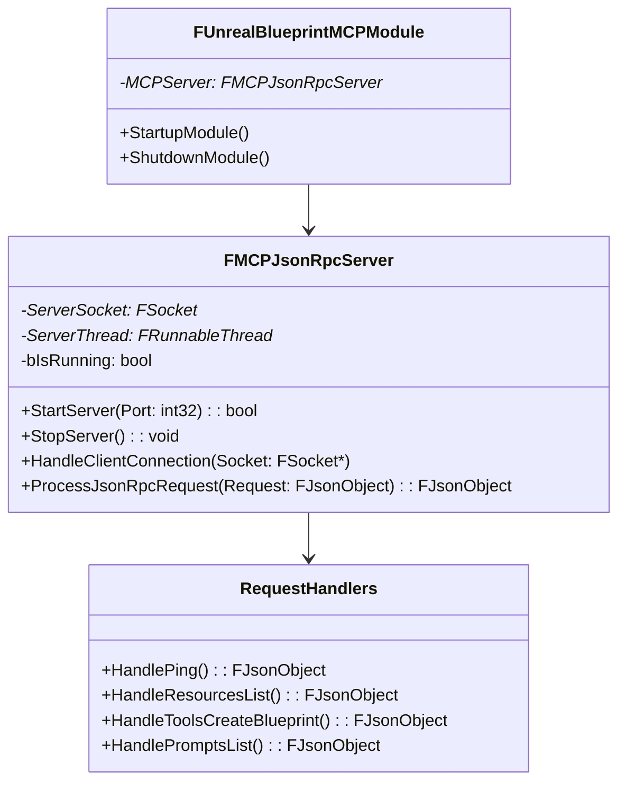
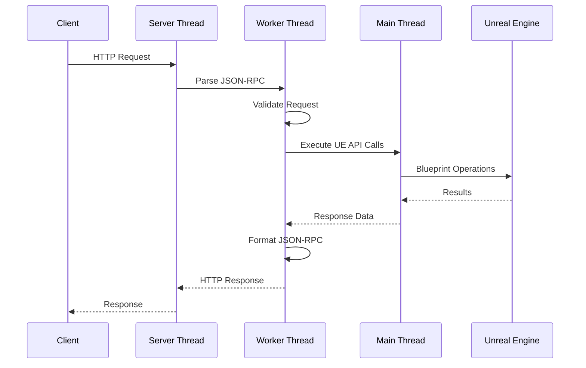

# UnrealBlueprintMCP - Technical Developer Guide

## Overview

This guide provides technical details for developers who want to understand, extend, or contribute to the UnrealBlueprintMCP plugin.

## Architecture Deep Dive

### Core Components



### Thread Safety

The plugin uses a multi-threaded architecture:

- **Main Thread**: Unreal Editor main thread
- **Server Thread**: Handles incoming connections
- **Worker Threads**: Process individual requests asynchronously

**Important**: All Unreal Engine API calls must be executed on the main thread using `AsyncTask(ENamedThreads::GameThread, ...)`.

### Request Processing Flow



## Extending the Plugin

### Adding New API Methods

1. **Define the handler function** in `Source/UnrealBlueprintMCP/Public/MCPJsonRpcServer.h`:
```cpp
TSharedPtr<FJsonObject> HandleYourNewMethod(TSharedPtr<FJsonObject> Params);
```

2. **Implement the handler** in `Source/UnrealBlueprintMCP/Private/MCPJsonRpcServer.cpp`:
```cpp
TSharedPtr<FJsonObject> FMCPJsonRpcServer::HandleYourNewMethod(TSharedPtr<FJsonObject> Params)
{
    TSharedPtr<FJsonObject> Result = MakeShareable(new FJsonObject);
    
    // Your implementation here
    // Remember to use AsyncTask for UE API calls
    
    return Result;
}
```

3. **Register the method** in `ProcessJsonRpcRequest()`:
```cpp
else if (Method == TEXT("your_namespace.your_method"))
{
    Result = HandleYourNewMethod(Params);
}
```

### Adding New Namespaces

Create logical groupings for related functionality:

```cpp
// resources.*
else if (Method.StartsWith(TEXT("resources.")))
{
    FString SubMethod = Method.RightChop(10); // Remove "resources."
    Result = HandleResourcesNamespace(SubMethod, Params);
}
```

### Error Handling Best Practices

Always provide meaningful error messages:

```cpp
if (!Blueprint)
{
    Result->SetStringField(TEXT("error"), 
        FString::Printf(TEXT("Blueprint not found: %s"), *BlueprintPath));
    return Result;
}
```

Use standard JSON-RPC error codes:
- `-32700`: Parse error
- `-32600`: Invalid Request
- `-32601`: Method not found
- `-32602`: Invalid params
- `-32603`: Internal error

## Development Setup

### Building from Source

1. **Clone the repository**:
```bash
git clone <repository-url>
cd unreal-blueprint-mcp
```

2. **Set up development environment**:
```bash
# Ensure Unreal Engine 5.6+ is installed
# Verify Visual Studio 2022 with C++ workload
# Install Python dependencies
pip install -r mcp-client/requirements.txt
```

3. **Generate project files**:
```bash
# Create a test project
# Copy plugin to Plugins folder
# Generate VS project files
```

4. **Configure IDE**:
   - Set breakpoints in `Source/UnrealBlueprintMCP/Private/MCPJsonRpcServer.cpp`
   - Use "Development Editor" configuration
   - Enable Unreal Engine debugging

### Testing During Development

Use the test script to verify changes:

```bash
# Test specific functionality
python mcp-client/tests/test_mcp_api.py

# Or test individual endpoints
curl -X POST http://localhost:8080 \
  -H "Content-Type: application/json" \
  -d '{"jsonrpc":"2.0","method":"ping","id":1}'
```

### Debugging Tips

1. **Enable verbose logging**:
```cpp
UE_LOG(LogTemp, VeryVerbose, TEXT("MCPJsonRpcServer: %s"), *DetailedMessage);
```

2. **Use Unreal's JSON utilities**:
```cpp
// Pretty print JSON for debugging
FString OutputString;
TSharedRef<TJsonWriter<>> Writer = TJsonWriterFactory<>::Create(&OutputString);
FJsonSerializer::Serialize(JsonObject.ToSharedRef(), Writer);
UE_LOG(LogTemp, Warning, TEXT("JSON: %s"), *OutputString);
```

3. **Thread debugging**:
```cpp
// Check which thread you're on
bool bIsGameThread = IsInGameThread();
UE_LOG(LogTemp, Warning, TEXT("Is Game Thread: %s"), bIsGameThread ? TEXT("Yes") : TEXT("No"));
```

## Performance Considerations

### Memory Management

- Use `TSharedPtr` for JSON objects
- Avoid memory leaks in async operations
- Clean up socket connections properly

### Network Optimization

- Keep response sizes reasonable
- Use connection pooling for high-frequency requests
- Implement request timeouts

### Unreal Engine Integration

- Minimize main thread blocking
- Use asset registry for efficient asset queries
- Cache Blueprint metadata when possible

## Security Considerations

### Input Validation

Always validate input parameters:

```cpp
if (!Params.IsValid() || !Params->HasField(TEXT("required_param")))
{
    return CreateErrorResponse(-32602, TEXT("Invalid params"));
}

FString UserInput = Params->GetStringField(TEXT("user_input"));
if (UserInput.IsEmpty() || UserInput.Len() > MAX_INPUT_LENGTH)
{
    return CreateErrorResponse(-32602, TEXT("Invalid input length"));
}
```

### Asset Path Validation

Prevent directory traversal attacks:

```cpp
FString AssetPath = Params->GetStringField(TEXT("asset_path"));
if (AssetPath.Contains(TEXT("..")) || !AssetPath.StartsWith(TEXT("/Game")))
{
    return CreateErrorResponse(-32602, TEXT("Invalid asset path"));
}
```

### Rate Limiting

Consider implementing rate limiting for production use:

```cpp
// Pseudo-code for rate limiting
if (RequestCount > MAX_REQUESTS_PER_MINUTE)
{
    return CreateErrorResponse(-32000, TEXT("Rate limit exceeded"));
}
```

## Common Patterns

### Async UE API Calls

```cpp
// Pattern for calling UE APIs from worker threads
AsyncTask(ENamedThreads::GameThread, [this, Params]()
{
    // UE API calls here
    UBlueprint* Blueprint = LoadObject<UBlueprint>(nullptr, *BlueprintPath);
    
    // Return to worker thread with results
    AsyncTask(ENamedThreads::AnyBackgroundThreadNormalTask, [this, Blueprint]()
    {
        // Process results and send response
    });
});
```

### Error Response Creation

```cpp
TSharedPtr<FJsonObject> CreateValidatedResponse(
    const FString& RequiredParam, 
    TSharedPtr<FJsonObject> Params)
{
    if (!Params.IsValid() || !Params->HasField(*RequiredParam))
    {
        return CreateErrorResponse(-32602, 
            FString::Printf(TEXT("Missing required parameter: %s"), *RequiredParam));
    }
    
    // Continue with implementation
    TSharedPtr<FJsonObject> Result = MakeShareable(new FJsonObject);
    // ... implementation
    return Result;
}
```

### Asset Registry Queries

```cpp
// Efficient asset querying
FAssetRegistryModule& AssetRegistryModule = 
    FModuleManager::LoadModuleChecked<FAssetRegistryModule>("AssetRegistry");
IAssetRegistry& AssetRegistry = AssetRegistryModule.Get();

FARFilter Filter;
Filter.ClassNames.Add(UBlueprint::StaticClass()->GetFName());
Filter.PackagePaths.Add(FName(*SearchPath));

TArray<FAssetData> AssetDataArray;
AssetRegistry.GetAssets(Filter, AssetDataArray);
```

## Future Enhancement Ideas

### Potential Features

1. **WebSocket Support**: Real-time bidirectional communication
2. **Authentication**: API key or token-based authentication
3. **Asset Streaming**: Stream large assets efficiently
4. **Blueprint Diffing**: Compare Blueprint versions
5. **Performance Metrics**: API usage analytics
6. **Plugin Management**: Install/uninstall plugins via API

### Architecture Improvements

1. **Plugin Architecture**: Modular handler system
2. **Configuration System**: Runtime configuration changes
3. **Caching Layer**: Asset metadata caching
4. **Event System**: Blueprint change notifications
5. **Batch Operations**: Multiple operations in single request

## Contributing Guidelines

### Code Style

- Follow Unreal Engine coding standards
- Use descriptive variable names
- Comment complex logic
- Include error handling

### Testing

- Add test cases for new features
- Verify thread safety
- Test error conditions
- Performance test with large projects

### Documentation

- Update API documentation
- Add inline code comments
- Update this technical guide
- Include usage examples

---

This technical guide should help developers understand the plugin's internals and extend it effectively. For specific implementation questions, refer to the source code or submit an issue.